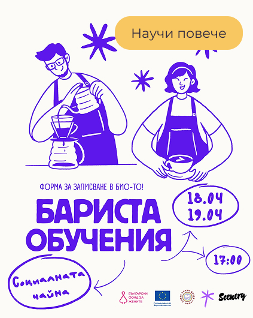
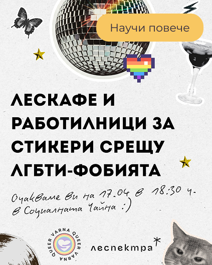
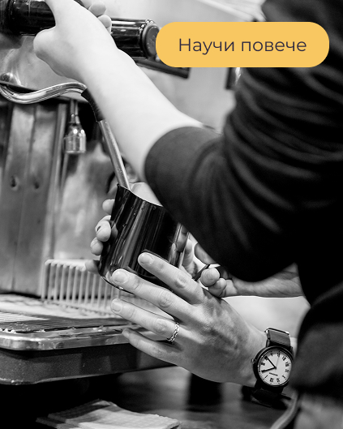
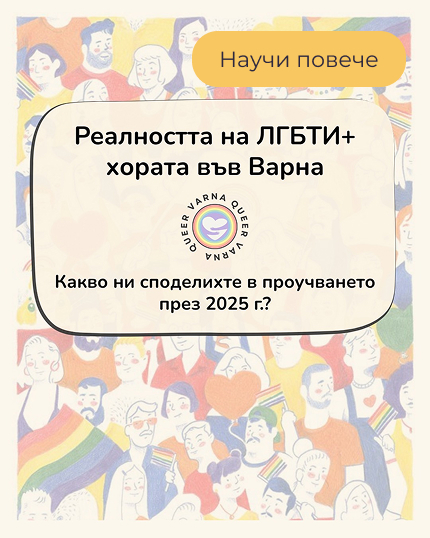














<section class="section pair">
  

    <h1>Куиър Варна</h1>
    
Фондация „Куиър Варна“ е неправителствена организация, която работи за създаването на по-отворена, безопасна и подкрепяща среда за ЛГБТИ+ хората във Варна и региона. В контекст, в който много хора все още се сблъскват с липса на видимост и сигурност, ние изграждаме условия за общност, изразяване и взаимна подкрепа.

    
Чрез култура, образование и общностни инициативи създаваме пространства за видимост, подкрепа и принадлежност.

    <a href="/mission" class="button">Научи повече</a>
  

  

    

    

      

        
      

      

        
      

      

        
      

    

    

      <button class="slider__dot slider__dot--active" aria-label="go to slide 1"></button>
      <button class="slider__dot" aria-label="go to slide 2"></button>
      <button class="slider__dot" aria-label="go to slide 3"></button>
    

  

  

</section>

<section class="block-decorated block-decorated__yellow">
  

    <h2>Нашите цели</h2>    
    

      <article class="card">
        <h3 class="card__title">Да подкрепяме местната ЛГБТИ+ общност</h3>
        
Помогни ни чрез доброволчество в събития и инициативи

        <a href="/volunteer/" class="button">Стани доброволец</a>
      </article>
      <article class="card">
        <h3 class="card__title">Да създаваме безопасни пространства</h3>
        
Работи с нас като партньор за изграждане на по-сигурна среда

        <a href="/partner/" class="button">Стани партньор</a>
      </article>
      <article class="card">
        <h3 class="card__title">Да разширяваме обхвата на дейността си</h3>
        
Подкрепи ни финансово, за да достигнем до повече хора

        <a href="/donate/" class="button">Стани дарител</a>
      </article>
    

  

</section>

<section class="section">
  <h2>Събития и новини</h2>
  

    
    
    
    
  

</section>

