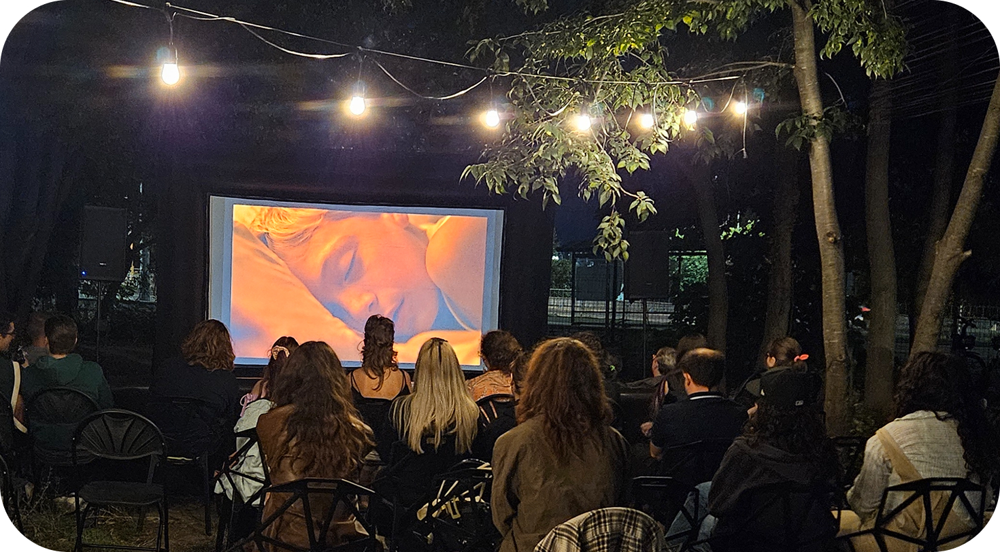
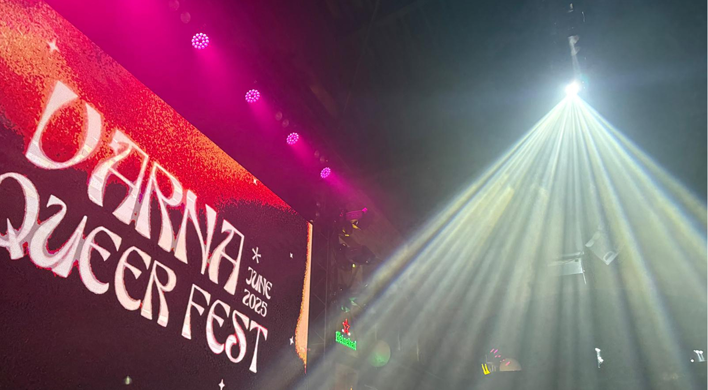
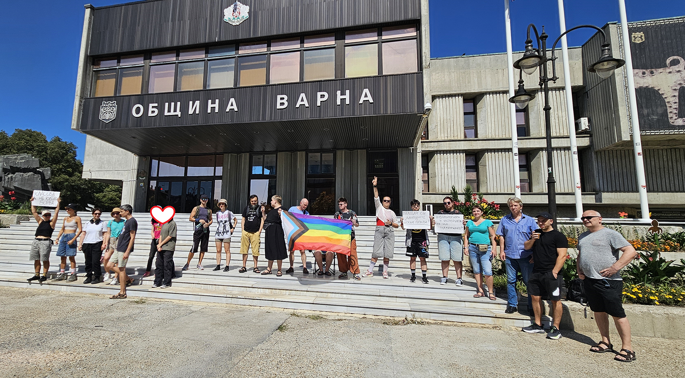



.GoalCard { background: var(--color-light-yellow); border-radius: var(--border-radius-card); padding: 1rem 1.5rem; }
.Partners__list { display: flex; justify-content: center; align-items: center; gap: 2rem; flex-wrap: wrap; }

.Partners {
  display: flex;
  flex-direction: column;
  align-items: center;
  padding: var(--spacing-m) var(--padding-side);
  gap: 1.2rem;
  background: var(--color-lilac);
}
.Partners__Title { font-size: var(--fs-h2); color: var(--color-navy); font-weight: 600; line-height: 1.1; }
.Partners__List { display: flex; justify-content: center; align-items: center; gap: 2rem; flex-wrap: wrap; width: 100%; }
.Partner__Logo { height: auto; width: auto; }








<section data-layer="about_us" class="pair">
  

    <h1>Куиър Варна</h1>
    
Фондация „Куиър Варна“ е неправителствена организация, която работи за създаването на по-отворена, безопасна и подкрепяща среда за ЛГБТИ+ хората във Варна и региона. В контекст, в който много хора все още се сблъскват с липса на видимост и сигурност, ние изграждаме условия за общност, изразяване и взаимна подкрепа.

    
Чрез култура, образование и общностни инициативи създаваме пространства за видимост, подкрепа и принадлежност.

    <a href="/mission" class="button">Научи повече</a>
  

  

    

    

      

        
      

      

        
      

      

        
      

    

    

      <button class="slider__dot slider__dot--active" aria-label="go to slide 1"></button>
      <button class="slider__dot" aria-label="go to slide 2"></button>
      <button class="slider__dot" aria-label="go to slide 3"></button>
    

  

  

</section>

<!-- GOALS -->

<section data-layer="goals" class="Goals container" style="align-self: stretch; overflow: hidden; flex-direction: column; justify-content: flex-start; align-items: flex-start; display: inline-flex">
  

    

      <svg width="1920" height="109" viewBox="0 0 1920 109" fill="none" xmlns="http://www.w3.org/2000/svg">
      <path d="M0 108.906C70.0788 68.4749 170.41 -59.1597 654.393 32.3153C1212.96 137.887 1539.52 -42.2492 1920 32.3153V108.906L0 108.906Z" fill="var(--yellow, #F8C761)"/>
      </svg>
    

  

  

    
Нашите цели

    

      

        

          
Да подкрепяме местната ЛГБТИ+ общност

          
Помогни ни чрез доброволчество в събития и инициативи

        

        

          
Стани доброволец

        

      

      

        

          
Да създаваме безопасни пространства

          
Работи с нас като партньор за изграждане на по-сигурна среда

        

        

          
Стани партньор

        

      

      

        

          
Да разширяваме обхвата на дейността си

          
Подкрепи ни финансово, за да достигнем до повече хора

        

        

          
Стани дарител

        

      

    

  

  

    

      <svg width="1920" height="158" viewBox="0 0 1920 158" fill="none" xmlns="http://www.w3.org/2000/svg">
      <path d="M1920 1.32249e-05L0 0V43.116C147.066 118.543 313.829 179.607 377.752 119.6C505.752 -0.557125 746.013 -38.9263 1251.17 116.436C1682.06 248.957 1583.17 15.9847 1920 61.4017V1.32249e-05Z" fill="var(--yellow, #F8C761)"/>
      </svg>
    

  

</section>

<section data-layer="news" class="News container" style="align-self: stretch; padding-left: 50px; padding-right: 50px; padding-top: 40px; padding-bottom: 40px; flex-direction: column; justify-content: flex-start; align-items: flex-start; gap: 24px; display: inline-flex">
  
Събития и новини

  

    

      
      

        
Научи повече

      

    

    

      
      

        
Научи повече

      

    

    

      
      

        
Научи повече

      

    

    

      
      

        
Научи повече

      

    

  

</section>

<section data-layer="Frame 29" class="Frame29 container" style="align-self: stretch; flex-direction: column; justify-content: flex-start; align-items: flex-start; display: inline-flex">
  

    

      <svg width="1920" height="109" viewBox="0 0 1920 109" fill="none" xmlns="http://www.w3.org/2000/svg">
      <path d="M0 108.906C70.0788 68.4749 170.41 -59.1597 654.393 32.3153C1212.96 137.887 1539.52 -42.2492 1920 32.3153V108.906L0 108.906Z" fill="var(--lilac, #D1C8FF)"/>
      </svg>
    

  

  

    
Партньори

    

      
    

  

  

    
Официални донори

  

</section>

